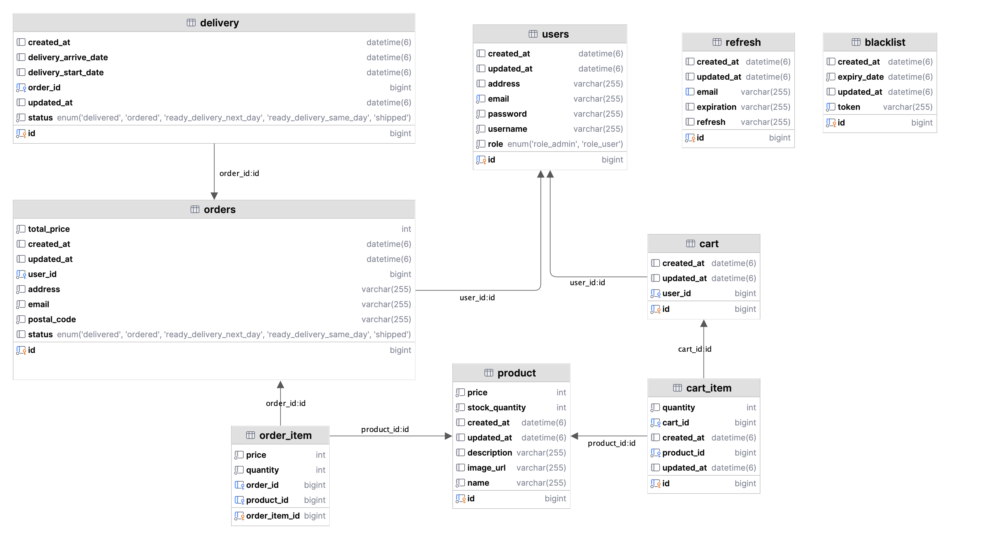

# NBE4-5-1-Team10

4기 5회차 10팀 커피프린스 10호점 1차 프로젝트

## 구성원

[윤원석](https://github.com/wonseokyoon)
[이화영](https://github.com/2hwayoung)
[김형준](https://github.com/Hyung-Junn)
[정준호](https://github.com/junho1131)

## 컨벤션

[컨벤션](https://github.com/prgrms-be-devcourse/NBE4-5-1-Team10/blob/main/docs/commit_convention.md)

## 요구사항 명세서
[요구사항 명세서](https://www.notion.so/1-15f3550b7b558073abf8efe80018410d?p=1a53550b7b558021acd7ef79dd25a803&pm=s)

## 서비스 소개

이 서비스는 사용자와 관리자가 웹 기반 환경에서 상호작용할 수 있는 전자상거래 플랫폼입니다.
사용자는 다양한 상품을 검색하고, 장바구니에 담아 구매할 수 있으며, 주문을 추적할 수 있습니다.

관리자는 상품 관리 및 주문 처리 기능을 통해 플랫폼 전체를 운영 및 최적화할 수 있습니다.

## 핵심 서비스

1. **사용자 인증 및 관리**: 사용자는 계정을 생성하고 로그인하여 서비스를 이용할 수 있으며, 관리자 권한이 있는 사용자는 관리자 페이지에 접근하여 다양한 관리 기능을 수행할 수 있습니다.
2. **상품 검색 및 관리**: 사용자는 상품 목록과 상세 정보를 확인할 수 있으며, 관리자는 새로운 상품을 추가, 수정, 삭제하여 상품 데이터를 관리할 수 있습니다.
3. **장바구니 및 주문 처리**: 사용자는 상품을 장바구니에 담고 주문을 완료할 수 있으며, 주문 내역 및 상세 정보를 조회할 수 있습니다. 주문 완료 후 시스템은 자동으로 재고를 관리합니다.
4. **관리자 기능**: 관리자는 상품 관리, 주문 목록 관리, 배송 상태 변경 및 알림 기능을 활용하여 운영 및 고객 서비스를 최적화할 수 있습니다.

## 주요 기능

- **로그인 및 로그아웃**: 사용자 및 관리자는 이메일과 비밀번호를 통해 로그인 및 로그아웃할 수 있으며, 이를 통해 각종 맞춤형 서비스를 제공합니다.
- **회원가입**: 신규 사용자는 이메일, 비밀번호, 주소 정보를 입력하여 가입할 수 있으며, 이메일 중복 가입은 불가합니다.
- **상품 목록 및 상세 조회**: 사용자는 전체 상품의 목록을 재고 상태와 함께 확인하고, 개별 상품의 세부 정보(상품명, 설명, 가격, 리뷰)를 조회할 수 있습니다.
- **장바구니 기능**: 사용자는 장바구니에 상품을 추가하거나 수량을 조정할 수 있으며, 장바구니의 상태를 실시간으로 확인할 수 있습니다.
- **주문 관리**: 사용자는 장바구니에 담긴 상품을 주문할 수 있으며, 주문 내역과 구체적인 주문 상세 정보를 조회할 수 있습니다.
- **관리자 상품 및 주문 관리**: 관리자는 상품 데이터를 추가, 수정, 삭제하고, 모든 사용자의 주문 목록을 관리하며, 배송 상태를 변경하고 알림을 전송할 수 있습니다.
## ERD




## 주요 기능

- 회원가입
- 로그인/로그아웃
- 주문
- 상품 관리
- 주문 관리
- 장바구니
- 배송 관리

## 유저 스토리
[유저스토리](https://www.notion.so/WTL-16f3550b7b5581a58277dac2626af8c1?p=1a53550b7b5580cda73cff80383e7668&pm=s)

## 브랜치 전략

- **브랜치 종류 및 역할**
  - `master` → 최종 결과물 브랜치
  - `develop` → 개발 과정에서 병합하는 브랜치
  - `feature` → 기능 개발 브랜치

## 개발 목적

이 프로젝트의 목표는 로컬 카페 Grids & Circles의 온라인 주문 시스템을 구축하는 것입니다. <br>
고객이 커피 원두 패키지를 온라인으로 주문하면, 해당 주문을 수집하여 일괄 처리하고, <당일 오후 2시 ~ 다음 날 오후 2시> 까지 같은 회원이 요청한 주문을 하나로 합쳐 효율적인 배송을 지원하는 구조를 갖춰 **사용자 및 운영자의 편의성을 향상시키는 것이 목적입니다.**

---

## 개발 환경

- DB: MySQL
- 프론트: NextJs

## 프로젝트 구조

- 도메인형
  - domain
  - controller
  - service
  - repository
  - dto

## 테스트

- local 환경 단위 테스트
- 유저 스토리 기반으로 최종 테스트 진행(Swagger,Postman)

## API 문서화

- Swagger API 문서화
  
  [API 명세서](https://www.notion.so/WTL-16f3550b7b5581a58277dac2626af8c1?p=1a03550b7b5580839539dbea48c93f45&pm=s)

## 🏗️ Architecture Overview

```
+-------------------------------------------------+
|                Frontend (Next.js)               |
|                [Runs in Browser]                |
+-----------------------+-------------------------+
                        |
                        | HTTP/REST (JSON)
                        |
+-----------------------v-------------------------+
|              Backend (Spring Boot)              |
|                [REST API Server]                |
+-----------------------+-------------------------+
                        |
                        | JPA (ORM)
                        |
+-----------------------v-------------------------+
|               DB (MySQL Container)              |
|           [Local DB via Docker-compose]         |
+-------------------------------------------------+

```
## 🏗️ System Components

**1️⃣ Frontend (Next.js)**

- **기술 스택**: Next.js (React 기반 프레임워크)
- **렌더링 방식**: SSR(서버사이드 렌더링) 및 CSR(클라이언트사이드 렌더링) 혼합 사용
- **API 호출 방식**:
    - 내장된 `fetch` API 사용
    - `openapi-fetch` 라이브러리를 활용하여 API 호출
- **역할**: 사용자 인터페이스 제공 및 RESTful API를 통해 백엔드와 통신

**2️⃣ Backend (Spring Boot)**

- **기술 스택**: Spring Boot (Java 기반 프레임워크)
- **역할**:
    - RESTful API 제공 (JSON 형식)
    - 비즈니스 로직 처리 및 데이터 검증
    - 프론트엔드 요청을 처리하고 MySQL 데이터베이스와 연동
- **데이터 연동 방식**:
    - `Spring Data JPA (ORM)`을 사용하여 MySQL과 연결
    - 트랜잭션 관리 및 데이터 접근 계층 구성

**3️⃣ Database (MySQL - Docker-compose)**

- **기술 스택**: MySQL 8 (Docker-compose 컨테이너로 실행)
- **역할**:
    - 애플리케이션의 영구적인 데이터 저장소 역할 수행
    - Spring Boot 백엔드와 연결하여 CRUD 연산 수행
- **구동 방식**:
    - `docker-compose`를 활용하여 로컬 환경에서 MySQL 컨테이너 실행

## 🛠️ Development Setup

**1️⃣ Run Backend (Spring Boot)**

```bash
# Navigate to backend project directory
cd backend

# Run the application
./gradlew bootRun

```

**2️⃣ Run Database (Docker Compose)**

```bash
# Start MySQL container with Docker Compose
# in root directory
docker-compose up -d

# Monitoring Logs
# Since logs are mapped to your local machine in ./mysql/conf, you can monitor them directly:
tail -f ./mysql_logs/general.log

# Stop Containers
docker-compose down

```

**3️⃣ Run Frontend (Next.js)**

```bash
# Navigate to frontend project directory
cd frontend

# Start Next.js development server
npm install  # Install dependencies (only needed once)
npm run dev  # Start development server

# Use OpenAPI to generate TypeScript types for the backend API
npm run codegen # Generate openapi typeScript definitions
npm run codegen:watch # Watch for API changes and regenerate types automatically

```


## 와이어프레임(Wireframe)

와이어프레임은 [Creatie Link](https://creatie.ai/file/152751559819701?page_id=M&shareId=152751559819701) 에서 확인할 수 있습니다.


## Agile & TDD: Development Approach

이 프로젝트는 애자일(Agile)과 테스트 주도 개발(TDD) 방식을 적용하여 빠른 개발과 유지보수성을 고려했습니다. 자세한 내용은 [develop_process.md](docs/develop_process.md)에서 확인할 수 있습니다.


